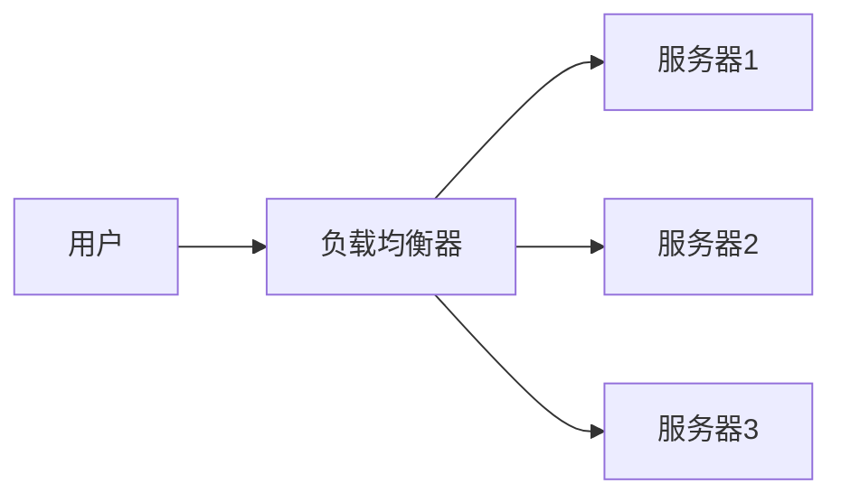

> 你每天上网，但你知道 192.168.1.1 和 8.8.8.8 有什么区别吗？
> 负载均衡器、反向代理、VPN……这些名词到底在做什么？

如果你对这些概念只有模糊的印象，这篇文章就是为你准备的。我们不聊高深的协议细节，只谈**每个概念是干什么的、为什么存在、之间有什么关系**。

---

## 一、IP 地址的世界：公网 vs 私网，特殊 IP

### 那些你可能见过的特殊 IP

| IP地址 | 用途 | 你该知道的事 |
|--------|------|-------------|
| **127.0.0.1** | 本机回环地址 | 就是"你自己"，任何发往这个地址的数据都不会离开本机 |
| **169.254.x.x** | DHCP 失败时的自动配置 | 电脑没拿到 IP 时自说自话分配的临时地址，看到它就说明网络出问题了 |
| **8.8.8.8** | Google 公共 DNS | 全世界用得最多的 DNS 之一，ping 它通常用来测试能不能上网 |
| **255.255.255.255** | 广播地址 | 向局域网内所有设备喊话 |

> 💡 **小技巧**：当你怀疑自己断网时，先 `ping 127.0.0.1`（测本机协议栈），再 `ping 8.8.8.8`（测外网连通性）。

### 公网 IP 和私网 IP

**私网 IP** 是规定好的"内部白名单"：

```
10.0.0.0/8       — 大型企业内部
172.16.0.0/12    — 中型企业
192.168.0.0/16   — 家庭/小办公室（你最熟悉的）
```

这些地址可以在任何局域网内随意使用，互不冲突——因为**出了你的局域网，它们就无效了**。

**公网 IP** 则必须全球唯一。你的路由器能上网，就是因为运营商给了你一个（或几个）公网 IP，全世界其他路由器都知道"这个 IP 归那个运营商管"。

### IP 是怎么分配到你手上的？

```
IANA（全球互联网号码分配机构）
  → 五大区域 RIR（如 APNIC 管亚太）
    → 运营商（中国电信、中国移动等）
      → 你
```

运营商拿到 IP 段后，通过 **WHOIS 数据库**登记 —— 这相当于 IP 的"房产证"。然后通过 **BGP 协议**向全世界的路由器广播："这个 IP 段归我管，数据交给我。"

> ⚠️ 你自己给电脑配一个公网 IP 是没用的——因为全球路由表里没有你，路由器不知道把你发的包送到哪。

---

## 二、路由与转发：数据包是怎么找到你的？

### 什么叫路由？

想象你在快递站寄包裹：
- 你把包裹交给快递员（你的路由器）
- 快递员查表：这个地址应该送给哪个中转站（下一跳）
- 逐级转发，直到送达目的地

这就是**路由转发**——每个路由器根据目标 IP，查自己的**路由表**，按照 **最长匹配原则**（目标 IP 跟路由表里前缀最长的那个匹配）选择下一跳。

### 路由算法 vs 路由转发

这两个概念经常被混用，其实分工不同：

| 概念 | 做什么 | 代表 |
|------|--------|------|
| **路由协议** | 计算"哪条路最优" | OSPF、RIP、BGP |
| **路由转发** | 查表、丢包、实际发送 | 硬件/软件查 FIB 表 |

打个比方：**路由协议是地图导航帮你规划路线，路由转发是按导航指示在每一个路口转弯。**

---

## 三、云服务器里的 IP 是怎么回事？

### VPC = 云上的私网王国

你买云服务器时，云厂商会给你一个 **VPC（虚拟私有云）**。本质上就是在云上用软件虚拟出一个隔离的局域网，用的就是前面说的 **私网 IP**。

### 为什么一台云服务器可以有多个私网 IP？

因为很多时候你需要在同一台机器上做这些事情：

- **跑多个相同端口的程序**：比如两个 web 服务都想占 80 端口，用不同 IP 区分
- **故障转移**：A 挂了，B IP 自动漂移过去接管
- **托管多个 SSL 网站**：每个域名绑定不同 IP

### 公网 IP 是独占的

你买的公网 IP 是**你一个人用的**，不是共享的。那么问题来了——公司的 100 台服务器总不能买 100 个公网 IP 吧？

这就是 **NAT 网关** 做的事：多台私网服务器共享一个公网 IP 上网，NAT 网关负责记录"谁发的请求，回复要给谁"。

---

## 四、负载均衡与反向代理

### 负载均衡器

简单说：**把请求均匀分给后端多台服务器处理。**



好处显而易见：
- 分摊压力，不会让某一台累死
- 某台挂了，自动切到其他机器（高可用）
- 横向扩展很方便——加机器就行

### 反向代理

反向代理做的事情跟负载均衡很像，但更灵活。它不仅能分发请求，还可以：

- **按域名转发**：`blog.example.com` 转发到博客服务，`api.example.com` 转发到 API 服务
- **缓存**：把经常请求的内容存一份，下次直接返回
- **改写 URL**、添加安全头、限流……

### 为什么叫"反向"？

因为和**正向代理**方向相反：

```
正向代理：你 → 代理服务器 → 目标网站（隐藏的是你）
反向代理：你 → 代理服务器 → 后端服务器（隐藏的是后端）
```

- **正向代理**（如 Shadowsocks、Clash）：帮你翻墙，网站不知道是你访问的
- **反向代理**（如 Nginx、HAProxy）：你访问一个网址，不知道背后是哪台服务器在处理

---

## 五、代理与 VPN

### 代理（Proxy）

代理的本质非常简单：**一个帮你转发请求的中转站。**

```
你的浏览器 → 代理软件（127.0.0.1:7890）→ 目标网站
```

配置好代理后：
- 你的请求发给本地的代理软件
- 代理软件再转发到目标网站
- 目标网站看到的是代理服务器的 IP，不是你真实的 IP

不过注意：**代理通常只针对特定应用生效**（比如浏览器），且**不一定加密**。

### VPN

VPN 的核心机制跟代理一样——**接收你的请求，替你转发**。但有几个关键区别：

| | 代理 | VPN |
|------|------|-----|
| **作用范围** | 特定应用（浏览器） | 整个操作系统 |
| **加密** | 可选（HTTPS 自己加密） | 默认全线加密 |
| **用途** | 翻墙、隐藏 IP | 连回公司内网、保护公共 WiFi 隐私、全局翻墙 |
| **原理** | 应用层转发 | 虚拟网卡 + 路由表接管所有流量 |

> 🧠 **一句话总结**：代理是给某个软件"开小灶"，VPN 是给你的电脑"换一条路"。

---

## 六、互联网的抽象设计——分层与封装

### 快递比喻

整篇文章讲到的所有概念，其实都建立在同一个设计思想之上：**分层——每一层只关心自己的事。**

```
应用层（HTTP/FTP）  = 你想寄的书
传输层（TCP/UDP）   = 打包的纸箱
网络层（IP）        = 纸箱上的地址
链路层（以太网/WiFi）= 快递员、货车、飞机
```

每一层给上一层"加个包装"，再交给下一层处理。这就是**封装**。

### 那些站在背后的人

- **文顿·瑟夫 & 鲍勃·卡恩**：TCP/IP 协议的发明者，互联网的地基就是他俩打的
- **伦纳德·克兰罗克**：提出分组交换理论——数据不需要走一条路，拆成小块走不同路径到目的地再拼起来
- **蒂姆·伯纳斯-李**：发明了 **WWW**（URL + HTTP + HTML），让普通人也能上网。而且他没有申请专利——如果这个技术变成私有，今天的互联网会是完全不同的样子

### 核心思想

互联网之所以能用几十年，核心在于**用抽象隔离复杂性**：

- 路由器不需要知道你发的是网页还是视频（它只看 IP 地址）
- 浏览器不需要知道数据经过了哪些光缆（它只管发 HTTP 请求）
- 每一层可以独立演进——IPv6 替换 IPv4 时，上面的应用层不需要做任何改动

> 这个设计思想如此优雅，以至于它已经成为数字世界的"物理定律"。

---

## 写在最后

这篇文章里提到的每个概念，本质上都是解决同一个问题：**怎么让两台远隔万里的电脑，可靠地交换数据。**

- IP 负责编址（"你是谁，你在哪"）
- 路由负责导航（"怎么找到你"）
- 代理/VPN 负责隐藏与转发（"不想让别人知道是你"）
- 负载均衡负责分摊（"别让一台机器累死"）
- 分层设计负责解耦（"大家各管各的"）

它们组合在一起，就构成了你每天用的互联网。

希望下次当你 `ping 8.8.8.8` 的时候，能想起这个数据包一路走来的旅程 🌐
